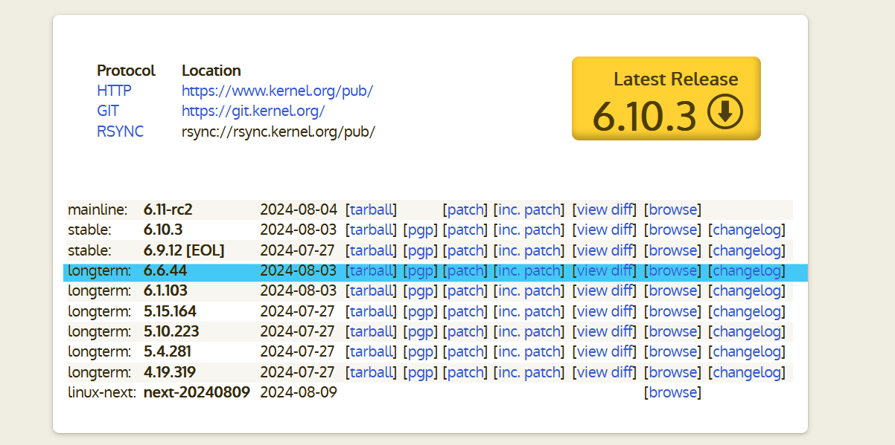

# Cómo compilar e instalar el kernel de Linux

## Instalar dependencias
Primero necesitamos instalar algunos paquetes necesarios para la compilación:

```bash
 sudo apt install build-essential libncurses-dev bison flex libssl-dev libelf-dev fakeroot dwarves
```

## Descargar y descomprimir el kernel
A continuación, debemos descargar el codigo fuente del kernel desde el sitio web oficial kernel.org. 



Usaremos la version ```longterm``` del kernel (Al meomento de este tutorial era la version 6.6.44).  Copie el enlace del hipervínculo ```tarball```. Luego use este enlace para descargar y descomprimir la fuente del kernel.

```bash
wget https://cdn.kernel.org/pub/linux/kernel/v6.x/linux-6.6.44.tar.xz
tar -xf linux-6.6.44.tar.xz
```

## Configurar el kernel
Primero ingrasamos al directorio del codigo fuente:

```bash
cd linux-6.6.44
```

La configuración del kernel se debe especificar en un archivo .config. Para no escribir este desde 0 vamos a copiar el archivo de configuración de su Linux actualmente instalado:

```bash
cp -v /boot/config-$(uname -r) .config
```

Sin embargo, este esta lleno de modulos y drivers que no necesitamos que pueden aumentar el tiempo de compilación. Por lo que utilizamos el comando localmodconfig que analiza los módulos del kernel cargados de su sistema y modifica el archivo .config de modo que solo estos módulos se incluyan en la compilación. Tomar en cuenta que esto causará que nuestro kernel compilado solo funcione en nuestra maquina, por lo que si quieren que sea portatil omitan este paso.

```bash
make localmodconfig
```

Luego tenemos que modificar el .config, ya que al copiar nuestro .config se incluyeron nuestras llaves privadas, por lo que tendremos que reliminarlas del .config.

```bash
$ scripts/config --disable SYSTEM_TRUSTED_KEYS
$ scripts/config --disable SYSTEM_REVOCATION_KEYS
$ scripts/config --set-str CONFIG_SYSTEM_TRUSTED_KEYS ""
$ scripts/config --set-str CONFIG_SYSTEM_REVOCATION_KEYS ""
```

## Compilar el kernel
Ahora es el momento de compilar el kernel. Para esto simplemente ejecute el comando:

```bash
$ fakeroot make
```

Utilizar ```fakeroot``` es necesario por que nos permite ejecutar el comando ```make``` en  un  entorno  donde  parece  que  se  tiene  permisos  de superusuario  para  la  manipulación  de  ficheros.  Es necesario  para  permitir a este comando crear archivos (tar, ar, .deb etc.) con ficheros con permisos/propietarios de superusuario.

También se puede acelerar la compilación utilizando varios núcleos de CPU. Por ejemplo:
```bash
$ fakeroot make -j4
```
utilizará cuatro núcleos de su computadora.

Si el proceso de compilación falla puede ejecutar el comando:

```bash
$ echo $?
```
para obtener el codigo de error.

## Instalar el kernel
La instalación se divide en dos partes: instalar los módulos del kernel e instalar el kernel mismo.

Primero se instalan los módulos del kernel ejecutando:
```bash
$ sudo make modules_install
```


Luego instalamos el kernel:
```bash
$ sudo make install
```
### Nota: Cuando iniciamos de nuevo, debemos presionar SHIFT al iniciar la VM para que nos muestre el GRUB. 
En esta seccion podemos escoger que Kernel Utilizar. 
Después de eso, reiniciamos la computadora para que se complete la instalación.
